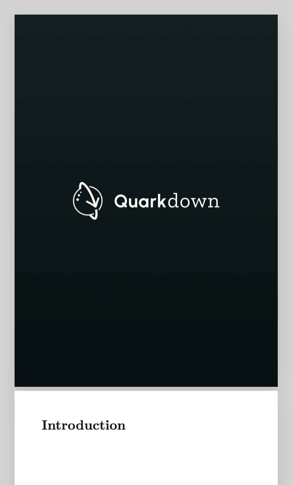

> For the complete documentation index, see [llms.txt](https://quarkdown.com/wiki/llms.txt).

# Book cover

A common pattern for [paged documents](document-types.md) is a full-bleed cover page, where an image spans the entire first page. This is achieved by combining:

- [`.pageformat`](page-format.md) to remove margins on the first page;
- [`.container`](container.md) to hold a full-width image.

> **Example 1**
> 
> ```markdown
> .doctype {paged}
> 
> .pageformat pages:{..1} margin:{0}
> 
> .container fullwidth:{yes} margin:{0}
>     !(100%)[Cover](cover.png)
> 
> # Introduction
> 
> ...
> ```
> 
> 