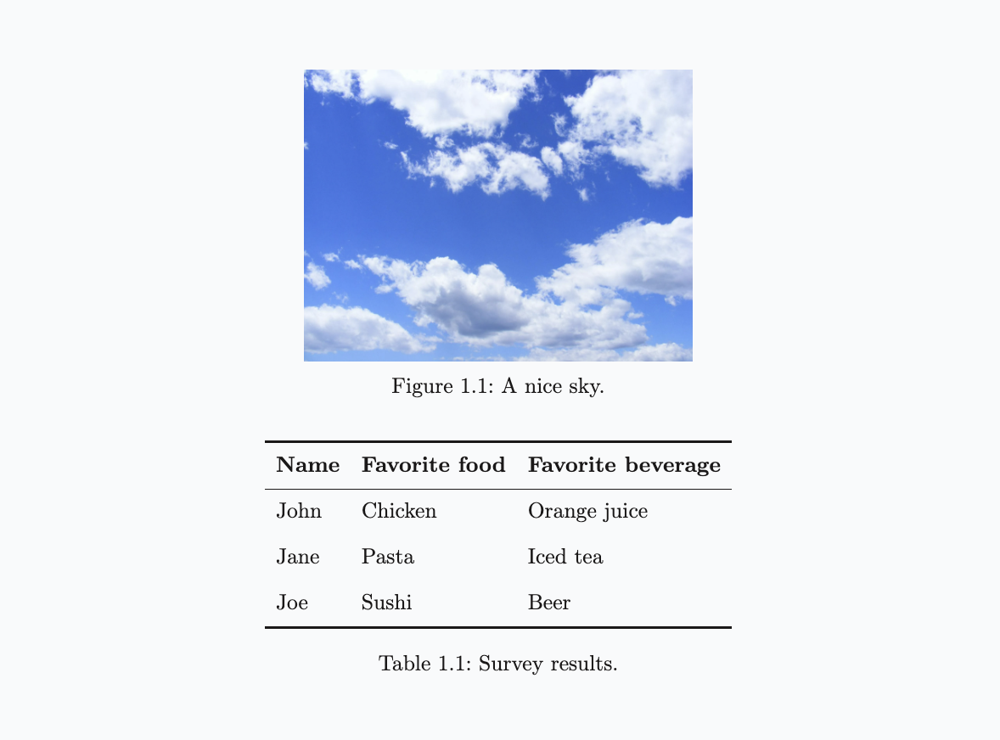
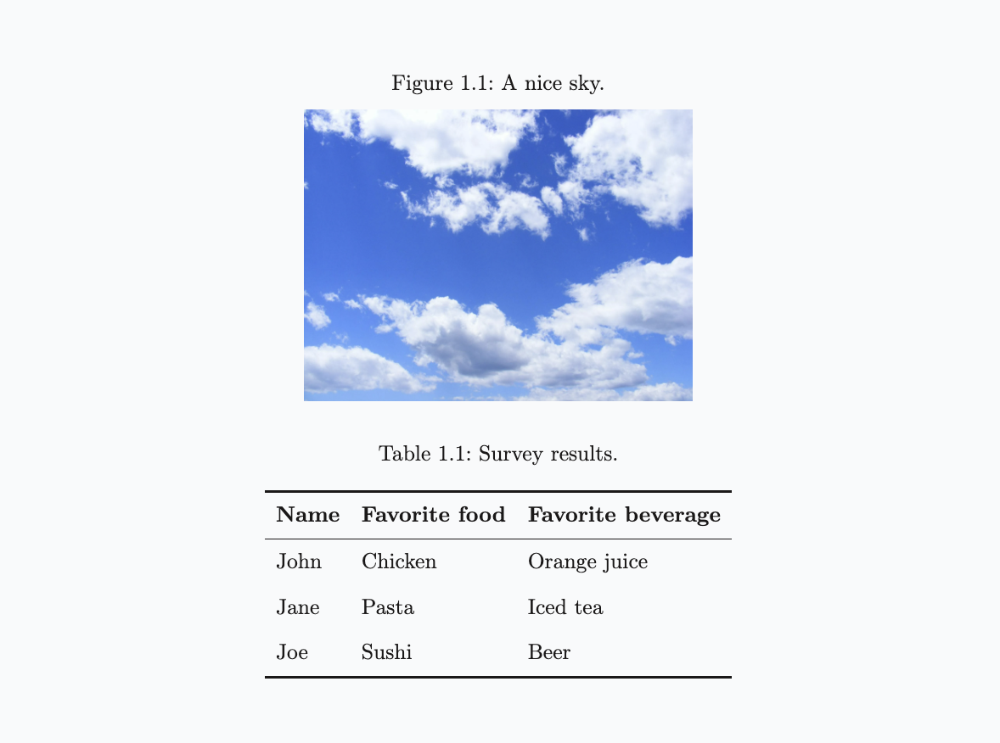
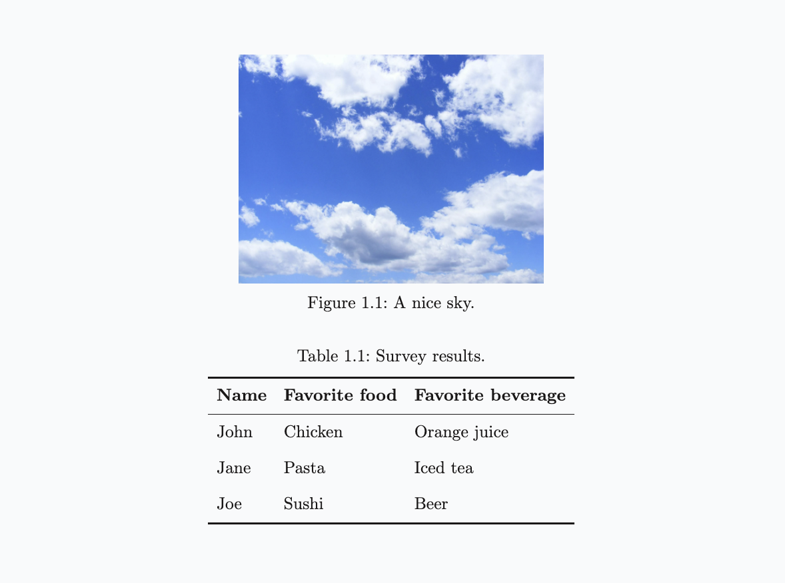

# Caption position

The **`.captionposition`**  function sets the global position of captions relative to the elements they describe.

This applies to:

- Figures

  - [Figure Markdown extension](figure.qd)
  - [`.figure`](custom-figure.qd)
  - [Mermaid diagrams](mermaid-diagrams.qd) and derivatives such as [XY charts](xy-chart.qd)
- Tables

  - [Table caption Markdown extension](table-caption.qd)
  - [Tables from CSV](table-from-csv.qd)
- Code blocks

  - [Code caption Markdown extension](code-caption.qd)
  - [`.code`](code.qd)

---

The primary parameter, called `default`, sets the global style for all captioned elements. Additional parameters `figures`, `tables`, and `code` override the default position for those specific element types.

Each parameter is optional and accepts `top` or `bottom` values. Documents use `.captionposition {bottom}` by default.

> **Example 1**
> 
> ```markdown
> .captionposition {bottom}
> 
> 
> 
> | Name | Favorite food | Favorite beverage |
> |------|---------------|-------------------|
> | John | Chicken       | Orange juice      |
> | Jane | Pasta         | Iced tea          |
> | Joe  | Sushi         | Beer              |
> "Survey results."
> ```
> 
> 

> **Example 2**
> 
> ```markdown
> .captionposition {top}
> ```
> 
> 

> **Example 3**
> 
> ```markdown
> .captionposition {bottom} tables:{bottom}
> ```
> 
> 

> Photo credits: [Pixabay](https://www.pexels.com/photo/blue-skies-53594/)