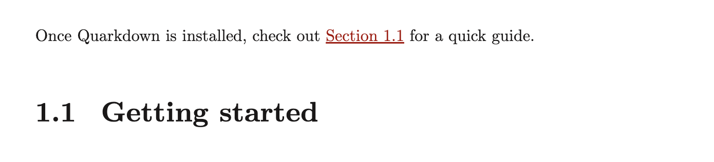
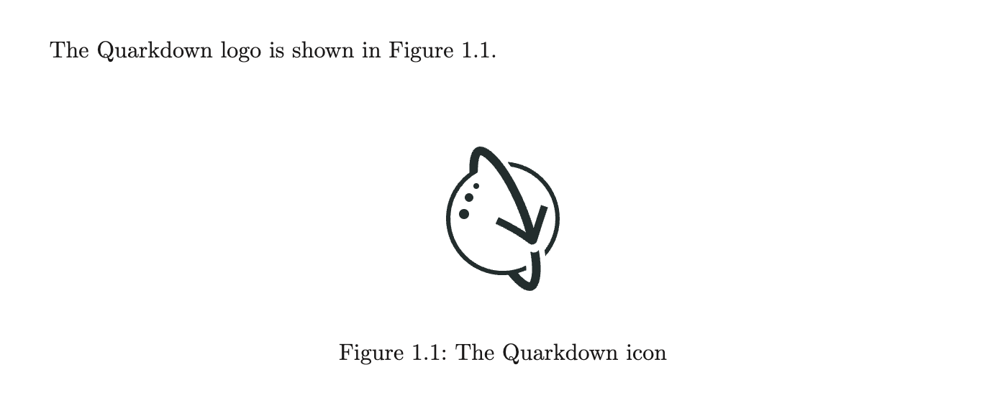
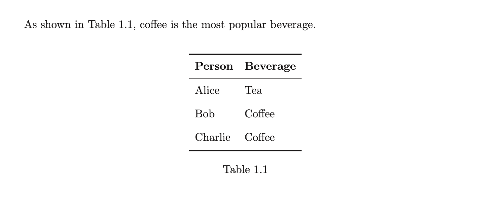
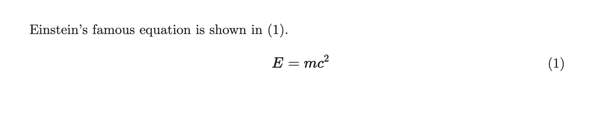
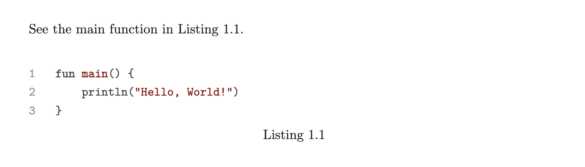
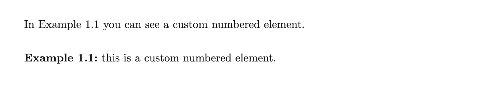

> For the complete documentation index, see [llms.txt](https://quarkdown.com/wiki/llms.txt).

# Cross references

In typesetting, cross-references are references to other parts of the document, such as figures, tables, sections, and equations.

In Quarkdown, you create a cross-reference using the **`.ref {id}`** function, where `id` is the cross-reference ID of the target element. The function can appear either before or after the target element.

> Cross-referencing works best when elements are numbered, and you have set a supported document language.
> See [Numbering](numbering.md) and [Localization](localization.md) for details.

You typically set the ID using the `{#id}` syntax. The exact location depends on the element type, as the following sections explain.

### Sections

> **Example 1**
> 
> ```markdown
> Once you install Quarkdown, check out .ref {getting-started} for a quick guide.
> 
> ## Getting started {#getting-started}
> ```
> 
> 

> In HTML rendering, the reference ID of headings also becomes the HTML `id` attribute, which makes them suitable for linking.

### Figures

> **Example 2**
> 
> ```markdown
> The Quarkdown logo is shown in .ref {logo}.
> 
>  {#logo}
> ```
> 
> 

### Tables

> **Example 3**
> 
> ```markdown
> As shown in .ref {data}, coffee is the most popular beverage.
> 
> | Person  | Beverage |
> |---------|----------|
> | Alice   | Tea      |
> | Bob     | Coffee   |
> | Charlie | Coffee   |
> {#data}
> ```
> 
> 

> **Example 4**
> 
> With a [caption](table-caption.md):
> 
> ```markdown
> | Person  | Beverage |
> |---------|----------|
> | Alice   | Tea      |
> | Bob     | Coffee   |
> | Charlie | Coffee   |
> "Beverage preferences" {#data}
> ```

### Equations

> **Example 5**
> 
> ```markdown
> Einstein's famous equation is shown in .ref {energy}.
> 
> $ E = mc^2 $ {#energy}
> ```
> 
> 

> **Example 6**
> 
> For multi-line equations:
> 
> ```markdown
> $$$ {#energy}
> E = mc^2
> $$$
> ```

> See [TeX Formulae](tex-formulae.md) for more information on writing equations in Quarkdown.

### Code blocks (listings)

> **Example 7**
> 
> ````markdown
> See the main function in .ref {main}.
> 
> ```kotlin {#main}
> fun main() {
>     println("Hello, World!")
> }
> ```
> ````
> 
> 

> **Example 8**
> 
> With a [caption](code-caption.md):
> 
> ````markdown
> ```kotlin "Hello World in Kotlin" {#main}
> fun main() {
>     println("Hello, World!")
> }
> ```
> ````

### Custom numbered elements

> The `.numbered` function is explained in detail in [Numbering](numbering.md#custom-numbered-elements).

> **Example 9**
> 
> ```markdown
> In Example .ref {my-example} you can see a custom numbered element.
> 
> .numbered {examples} ref:{my-example}
>     number:
>     **Example .number:** this is a custom numbered element.
> ```
> 
> 