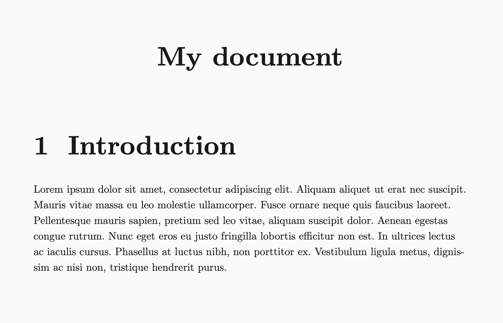

> For the complete documentation index, see [llms.txt](/wiki/llms.txt).

# Decorative headings

To prevent a heading from being numbered and from appearing in the [table of contents](table-of-contents.md), append a `!` after the last `#` sign. For example: `#!`, `##!`, `###!`, etc.

> **Example 1**
> 
> ````markdown
> ```markdown
> .center
>     #! My document
> 
> ## Introduction
> 
> .loremipsum
> ```
> ````
> 
> 

> A heading with all optional flags disabled via [`.heading`](headings.md) is equivalent to a decorative heading:
> 
> ```markdown
> .heading {My decorative heading} depth:{2} numbered:{no} indexed:{no} breakpage:{no}
> ```