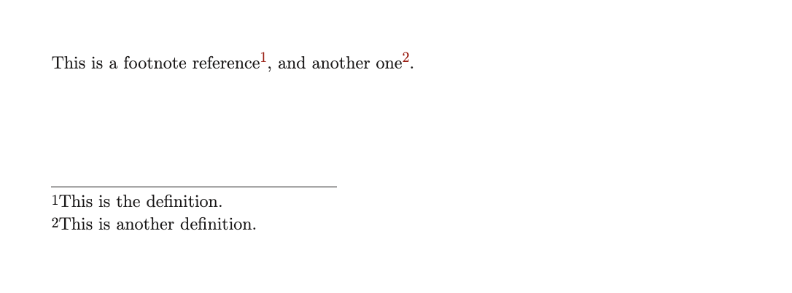
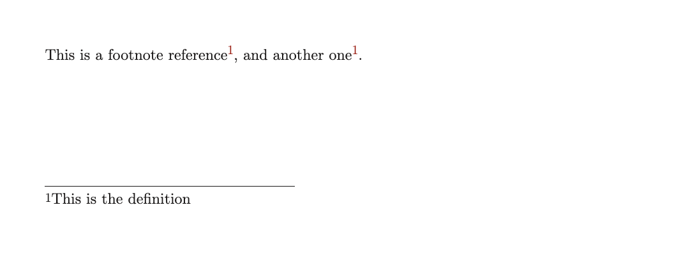
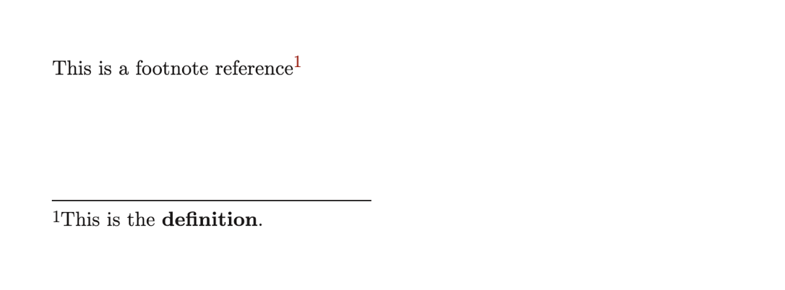
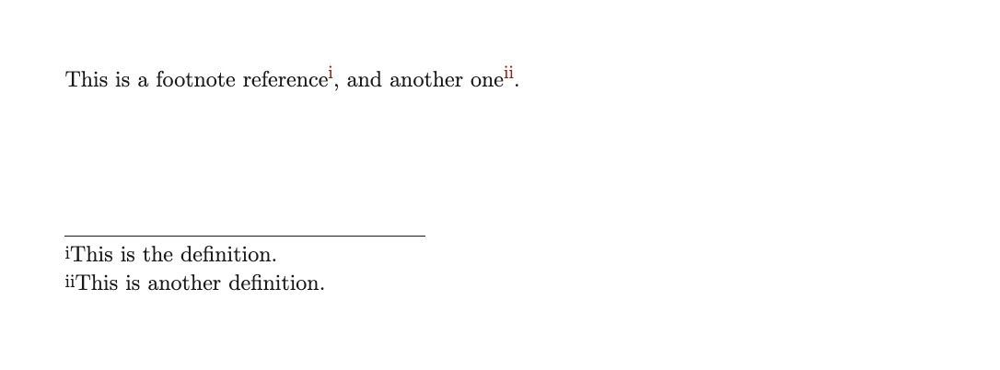

> For the complete documentation index, see [llms.txt](https://quarkdown.com/wiki/llms.txt).

# Footnotes

Footnotes allow readers to reference additional information without cluttering the main content.

## Compact footnotes

Quarkdown introduces a compact `[^label: definition]` syntax that allows you to define footnotes directly at their reference point.

> **Example 1**
> 
> ```markdown
> This is a footnote reference[^first: This is the definition.],
> and another one[^second: This is another definition.].
> ```
> 
> 

Named footnotes can be referenced multiple times.

> **Example 2**
> 
> ```markdown
> This is a footnote reference[^first: This is the definition],
> and another one[^first].
> ```
> 
> 

Definitions can include inline formatting.

> **Example 3**
> 
> ```markdown
> This is a footnote reference[^first: This is the **definition**.]
> ```
> 
> 

### Anonymous footnotes

When an inlined footnote does not need to be referenced elsewhere, you can omit the label to create an *anonymous* footnote.

> **Example 4**
> 
> ```markdown
> This is a footnote reference[^: This is the definition.],
> and another one[^: This is another definition.].
> ```

## Standard footnotes

Quarkdown also supports the standard footnote syntax provided by many Markdown flavors.

This approach is more verbose but allows for a clean separation between the footnote reference and its definition, reducing clutter in the main text.

```markdown
This is a footnote reference[^1].

[^1]: This is the definition.
```

Inline formatting is also supported in the definition:

```markdown
[^1]: This is the **definition**.
```

Long definitions can span multiple lines. Indentation is not significant:

```markdown
[^1]: This is
      the definition.
```

When you have multiple footnotes, separate the definitions with at least one blank line:

```markdown
This is a footnote reference[^first], and another one[^second].

[^first]: This is the definition.

[^second]: This is another definition.
```

Multiple references to the same footnote label are allowed, and they all point to the same definition:

```markdown
This is a footnote reference[^first], and another one[^first].

[^first]: This is the definition.
```

The footnote label can be any string, and the definition can appear anywhere in the document:

```markdown
[^first]: This is the definition.

This is a footnote reference[^first], and another one[^second].

[^second]: This is another definition.
```

## Numbering

Footnotes are numbered by default with decimal numbers, starting from 1. To apply a different numbering style, such as Roman numerals, use the `.numbering` function. See [*Numbering*](numbering.md) for more information.

> **Example 5**
> 
> ```markdown
> .numbering
>     - footnotes: i
> ```
> 
> 

Footnotes are numbered incrementally across the subdocument. Page-level numbering is not supported yet.

## Display

Footnotes render differently depending on the document type. See [*Document types*](document-types.md) for more information.