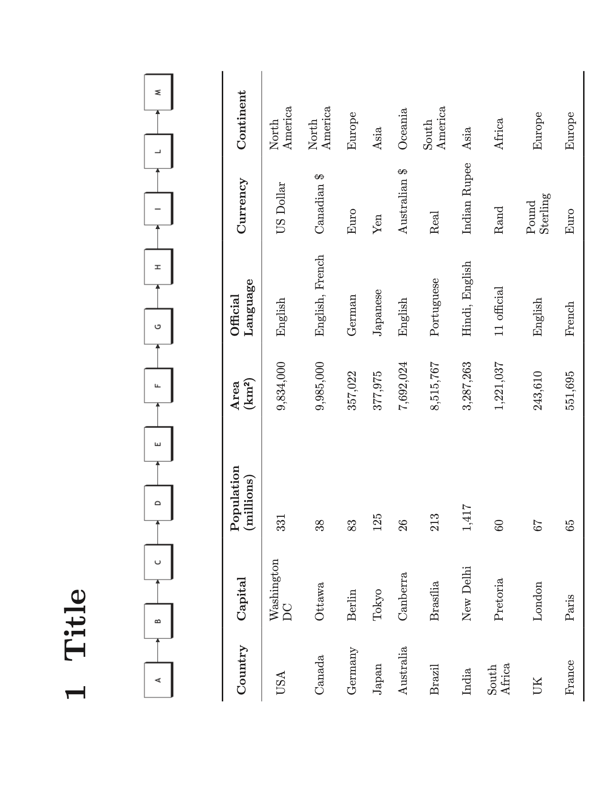
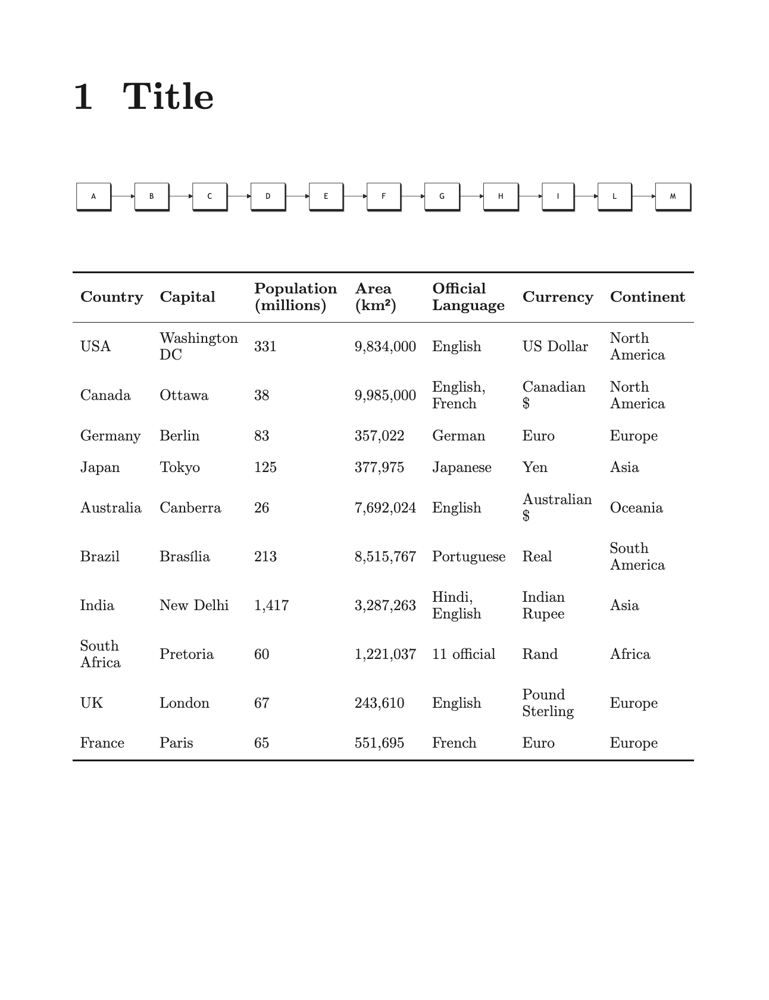

# Landscape content

> This feature is **experimental**.

Fitting wide tables, diagrams, charts, or other horizontally expansive elements onto a vertical page can be challenging, and the content may become difficult to read when constrained to portrait orientation.

To address this limitation, the **`.landscape`** function renders content in landscape orientation within a portrait page. This approach is ideal for printing or viewing resources that benefit from extra horizontal space.

```markdown
.landscape
    Content
```



For comparison, the same content in portrait orientation would stretch and compress the content, reducing readability:

