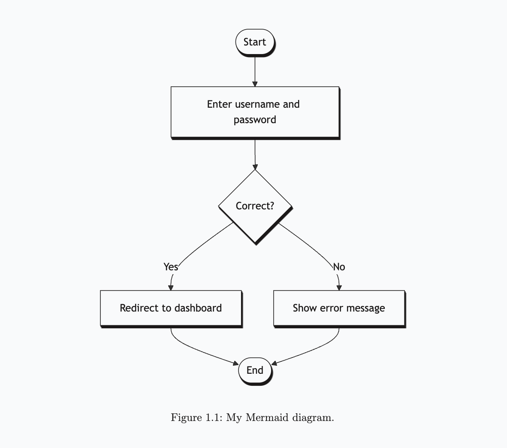
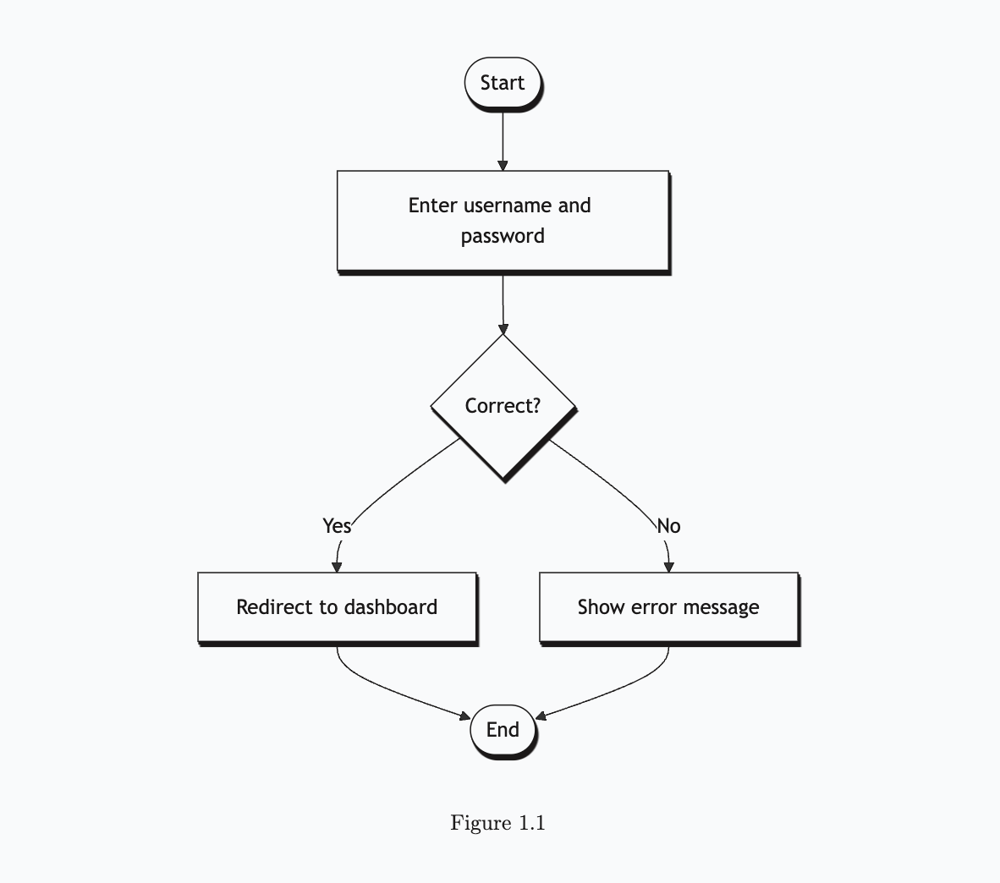

> For the complete documentation index, see [llms.txt](/wiki/llms.txt).

# Mermaid diagrams

Quarkdown offers full Mermaid interoperability via the **`.mermaid`** block function, bringing Mermaid diagrams and charts into your documents.

The block parameter accepts the Mermaid code content. Refer to [Mermaid’s documentation](https://mermaid.js.org/intro/) for information about its powerful syntax to create flowcharts, pie charts, class and sequence diagrams, and much more.

> **Example 1**
> 
> ```markdown
> .mermaid
>     flowchart TD
>         A([Start]) --> B[Enter username and password]
>         B --> C{Correct?}
>         C -- Yes --> D[Redirect to dashboard]
>         C -- No --> E[Show error message]
>         D --> F([End])
>         E --> F
> ```
> 
> ```mermaid
> flowchart TD
>     A([Start]) --> B[Enter username and password]
>     B --> C{Correct?}
>     C -- Yes --> D[Redirect to dashboard]
>     C -- No --> E[Show error message]
>     D --> F([End])
>     E --> F
> ```

The Mermaid code accepts Quarkdown function calls.

> **Example 2**
> 
> ```markdown
> .var {n1} {2}
> .var {n2} {3}
> 
> .mermaid
>     flowchart TD
>         A([Start]) --> B{.n1 + .n2 = ?}
>         B -- .sum {.n1} {.n2} --> C([Correct])
> ```
> 
> ```mermaid
> flowchart TD
>     A([Start]) --> B{2 + 3 = ?}
>     B -- 5 --> C([Correct])
> ```

## Diagram from file

Since function calls can be used inside the block argument, you can leverage the [**`.read`**](file-text-content.md) function to load text from a file.

```markdown
.mermaid
    .read {chart.mmd}
```

## Diagram caption and numbering

An optional `caption` argument assigns a caption to the diagram and lets the block be numbered according to the document’s *figure* [numbering](numbering.md).

> **Example 3**
> 
> ```markdown
> .mermaid caption:{My Mermaid diagram.}
>     flowchart TD
>         A([Start]) --> B[Enter username and password]
>         B --> C{Correct?}
>         C -- Yes --> D[Redirect to dashboard]
>         C -- No --> E[Show error message]
>         D --> F([End])
>         E --> F
> ```
> 
> 

> **Example 4**
> 
> To number the diagram without a caption, pass an empty string as the caption value.
> 
> ```markdown
> .mermaid caption:{}
>     flowchart TD
>         A([Start]) --> B[Enter username and password]
>         B --> C{Correct?}
>         C -- Yes --> D[Redirect to dashboard]
>         C -- No --> E[Show error message]
>         D --> F([End])
>         E --> F
> ```
> 
> 