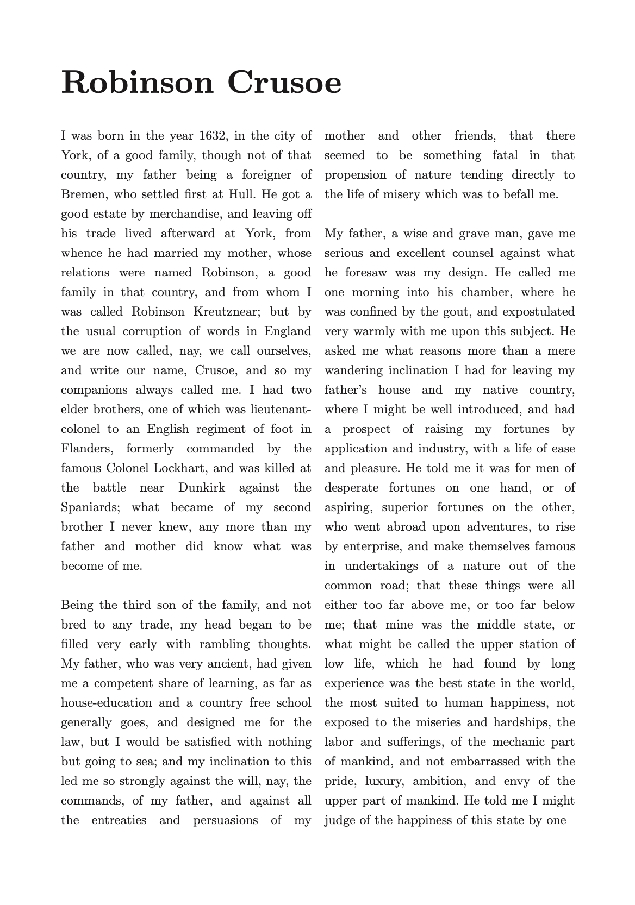
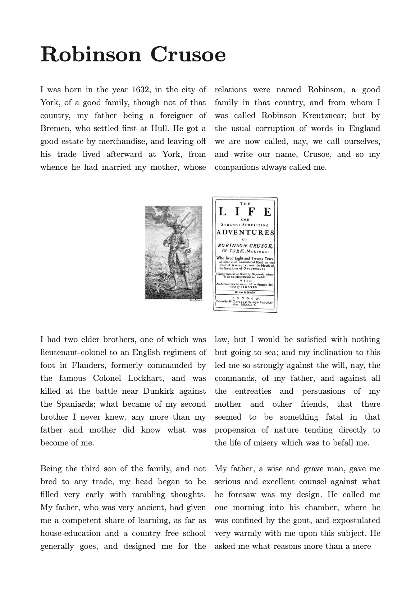

> For the complete documentation index, see [llms.txt](https://quarkdown.com/wiki/llms.txt).

# Multi-column layout

[**`.pageformat {columns}`**](page-format.md) applies a multi-column layout to each page when the value of `columns` is higher than 1.

> **Example 1**
> 
> ```markdown
> .pageformat columns:{2}
> ```
> 
> 

## Full-span content

In a multi-column layout, all elements except for level 1-3 headings render within their own column.
You can set some content to span across all columns of the layout by using the **`.fullspan`** block function.

> **Example 2**
> 
> ```markdown
> .fullspan
>     
> ```
> 
> 