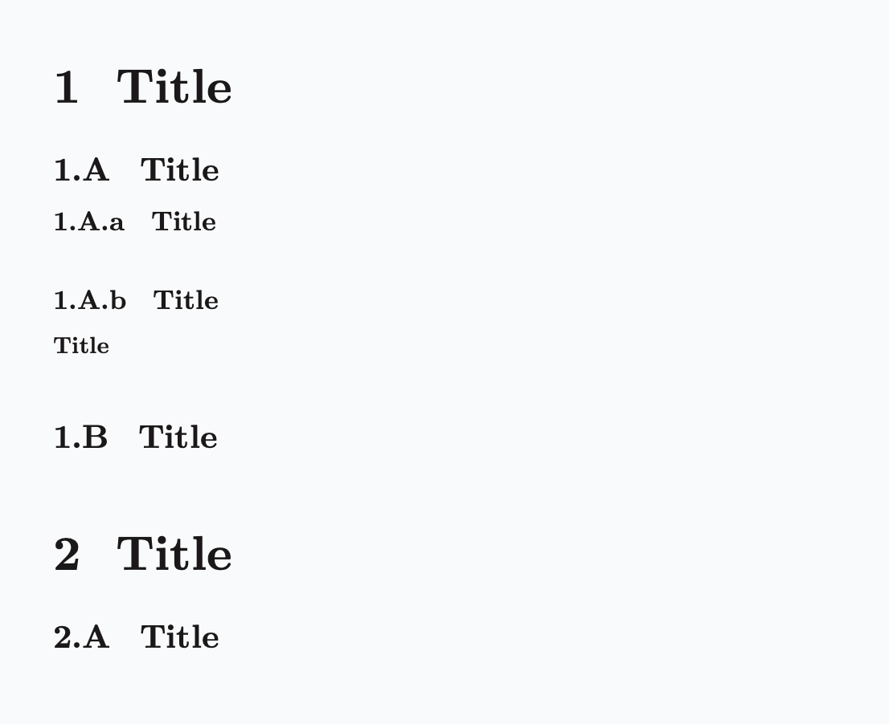
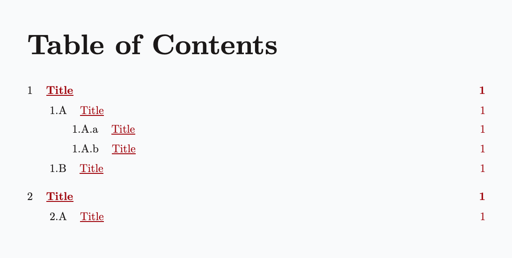
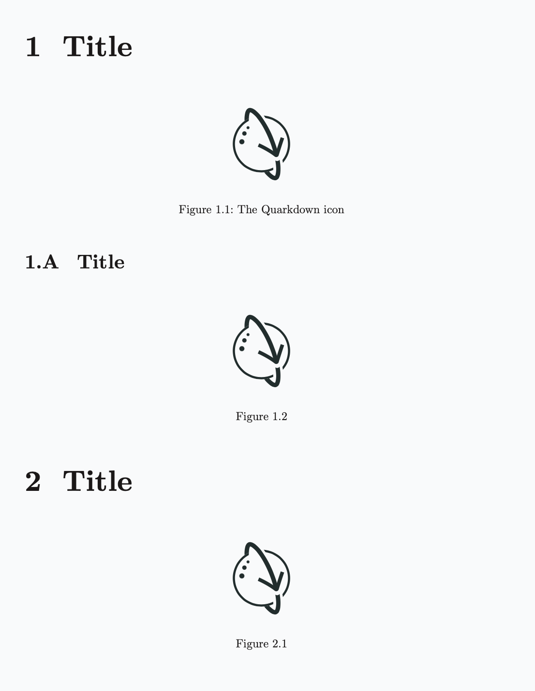
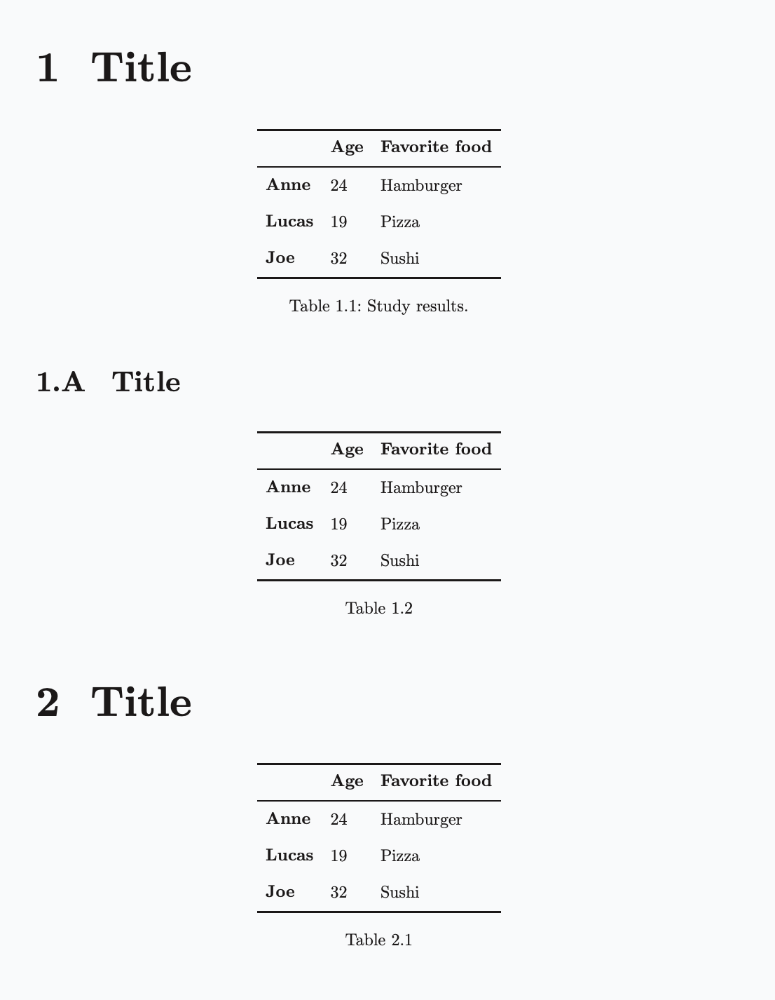
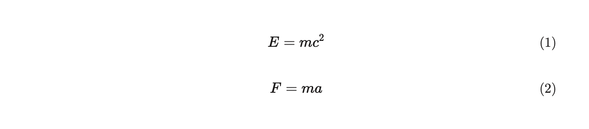
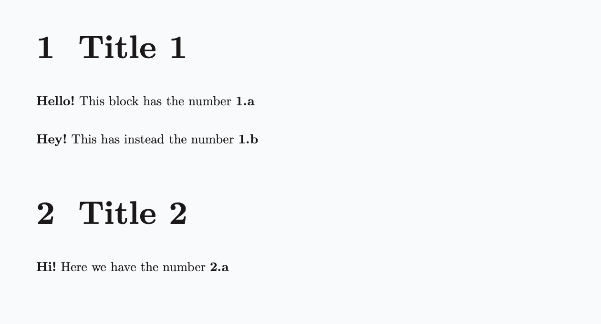

> For the complete documentation index, see [llms.txt](/wiki/llms.txt).

# Numbering

The **`.numbering`** function sets the global numbering configuration of the document. The following elements can be numbered:

- Headings and [table of contents](table-of-contents.md) entries
- [Figures](figure.md)
- Tables
- [Equations](tex-formulae.md)
- Code blocks
- [Footnotes](footnotes.md)
- Custom elements (`.numbered`)

The configuration is represented by a [Dictionary](dictionary.md). The following snippet shows the full configuration schema, where all entries are optional:

```yaml
.numbering
  - headings: <format>
  - figures: <format>
  - tables: <format>
  - equations: <format>
  - code: <format>
  - footnotes: <format>
```

Each format parameter accepts either `none` or a string where each character represents either a counter or a fixed symbol:

- `1` for decimal (`1, 2, 3, ...`)
- `a` for lowercase latin alphabet (`a, b, c, ...`)
- `A` for uppercase latin alphabet (`A, B, C, ...`)
- `i` for lowercase roman numerals (`i, ii, iii, ...`)
- `I` for uppercase roman numerals (`I, II, III, ...`)
- A backslash (`\`) escapes the next character, treating it as a fixed symbol. For example, `\1` produces a literal `1` instead of a decimal counter.
- Any other character is a fixed symbol.

## Default formats

The default numbering format, if unspecified, is:

- For `paged` documents:

  - `1.1.1` for headings
  - `1.1` for figures and tables
  - `(1)` for equations
  - `1` for footnotes

- 

- For `plain` documents:

  - `(1)` for equations
  - `1` for footnotes

- 

- For `slides` and `docs` documents:

  - `1` for footnotes

You can turn off any active numbering configuration via the **`.nonumbering`** function.

## Merging configurations

By default, `.numbering` enhances the current numbering configuration by merging the new configuration with the existing one. This means only the specified entries are updated while the rest remain unchanged.

To avoid merging and turn off numbering rules for unspecified entries, set the `merge:{no}` argument:

```yaml
.numbering merge:{no}
    - figures: 1.1
```

## Headings

> **Example 1**
> 
> ```markdown
> .numbering
>     - headings: 1.A.a
> 
> ## Title    <!--   1   -->
> ### Title   <!--  1.A  -->
> #### Title  <!-- 1.A.a -->
> #### Title  <!-- 1.A.b -->
> ##### Title <!-- None  -->
> ### Title   <!--  1.B  -->
> ## Title    <!--   2   -->
> ### Title   <!--  2.A  -->
> ```
> 
> 
> 
> 

### Excluding headings from numbering

To prevent a heading from being numbered, you can either:

- Use a [decorative heading](headings.md#decorative-headings) (`#!`, `##!`, etc.), which also excludes the heading from the [table of contents](table-of-contents.md).
- Use the [`.heading`](headings.md) function with `numbered:{no}` for more granular control, allowing you to independently decide whether the heading appears in the table of contents.

## Figures

[Figures](figure.md) are numbered only if they have a **caption**, which may also be empty.

> **Example 2**
> 
> ````markdown
> ```markdown
> .numbering
>     - headings: 1.A.a
>     - figures: 1.1
> 
> ## Title
> 
> 
> 
> ### Title
> 
> 
> 
> ## Title
> 
> 
> ```
> ````
> 
> 

## Tables

> **Example 3**
> 
> ```markdown
> .numbering
>     - headings: 1.A.a
>     - tables: 1.1
> 
> ## Title
> 
> |           | Age | Favorite food |
> |-----------|-----|---------------|
> | **Anne**  | 24  | Hamburger     |
> | **Lucas** | 19  | Pizza         |
> | **Joe**   | 32  | Sushi         |
> "Study results."
> 
> ### Title
> 
> |           | Age | Favorite food |
> |-----------|-----|---------------|
> | **Anne**  | 24  | Hamburger     |
> | **Lucas** | 19  | Pizza         |
> | **Joe**   | 32  | Sushi         |
> 
> ## Title
> 
> |           | Age | Favorite food |
> |-----------|-----|---------------|
> | **Anne**  | 24  | Hamburger     |
> | **Lucas** | 19  | Pizza         |
> | **Joe**   | 32  | Sushi         |
> ```
> 
> 

## Equations

[Math blocks](tex-formulae.md) (equations) are numbered only if they have a [cross-reference ID](cross-references.md).

> **Example 4**
> 
> ```markdown
> .numbering
>     - equations: (1)
> 
> $ E = mc^2 $ {#energy}
> 
> $ F = ma $ {#force}
> ```
> 
> 

Conventionally, if the equation is not cross-referenced anywhere in the document, but you still want it to be numbered, you can use `_` as the ID.

> **Example 5**
> 
> ```markdown
> $ E = mc^2 $ {#_}
> 
> $ F = ma $ {#_}
> ```

## Code blocks

> **Example 6**
> 
> ````markdown
> .numbering
>     - code: 1
> 
> ```python
> def hello():
>     print("Hello, world!")
> ```
> 
> ```kotlin
> fun main() {
>     println("Hello, world!")
> }
> ```
> ````
> 
> 

## Footnotes

The numbering format of [footnotes](footnotes.md) is flat, meaning it only considers the leftmost symbol and ignores the rest.

If not specified, footnotes format defaults to `1` (decimal).

> **Example 7**
> 
> ```markdown
> .numbering
>     - footnotes: i
> 
> Here is a footnote reference[^: First], and another one[^: Second].
> ```
> 
> 

## Custom numbered elements

Along with the built-in numerable elements discussed above, Quarkdown allows any element to be numbered if wrapped in a `.numbered` block.

The function accepts two arguments:

1. A key string. The element’s number is counted across previous occurrences with the same key.
2. A [lambda](lambda.md) block that takes the number as an argument, formatted according to the active numbering format.

```markdown
.numbered {greetings}
    number:
    **Hello!** This block has the number **.number**
```

Executing the previous block renders an empty string in place of `number` because you need to specify the numbering format for `greetings` in the `.numbering` call:

```yaml
.numbering
    ...
    - greetings: 1.a
```

A numbered block can also be cross-referenced. See [*Cross-references*](cross-references.md#custom-numbered-elements) for details.

Full example:

> **Example 8**
> 
> ```markdown
> .numbering
>     - headings: 1.1
>     - greetings: 1.a
> 
> ## Title 1
> 
> .numbered {greetings}
>     number:
>     **Hello!** This block has the number **.number**
> 
> .numbered {greetings}
>     number:
>     **Hey!** This has instead the number **.number**
> 
> ## Title 2
> 
> .numbered {greetings}
>     number:
>     **Hi!** Here we have the number **.number**
> ```
> 
> 

## Localization

The localized name of the labeled element appears in captions if [`.doclang`](document-metadata.md) is set and the locale is supported. For instance, *Figure* and *Table* for the English locale, *Figura* and *Tabella* for Italian.