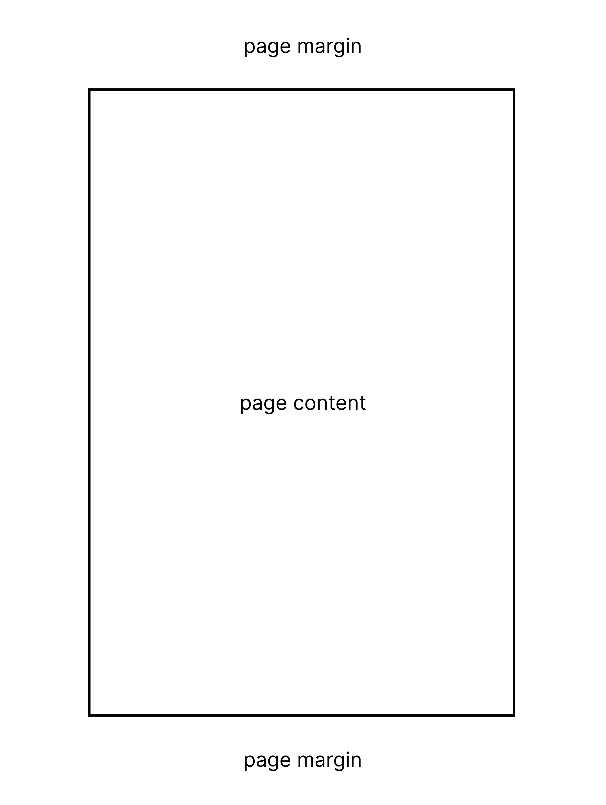
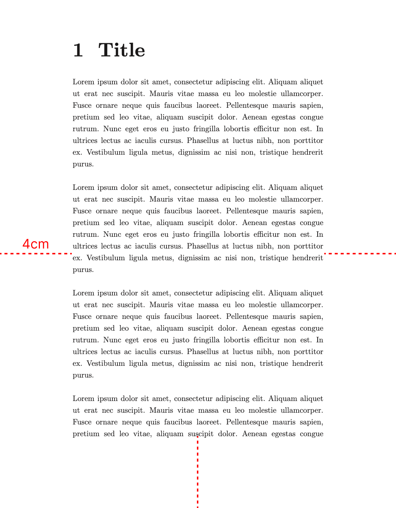
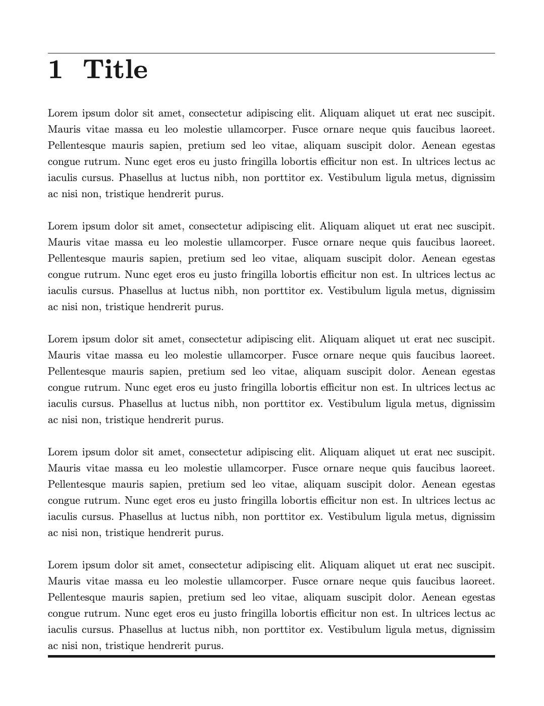
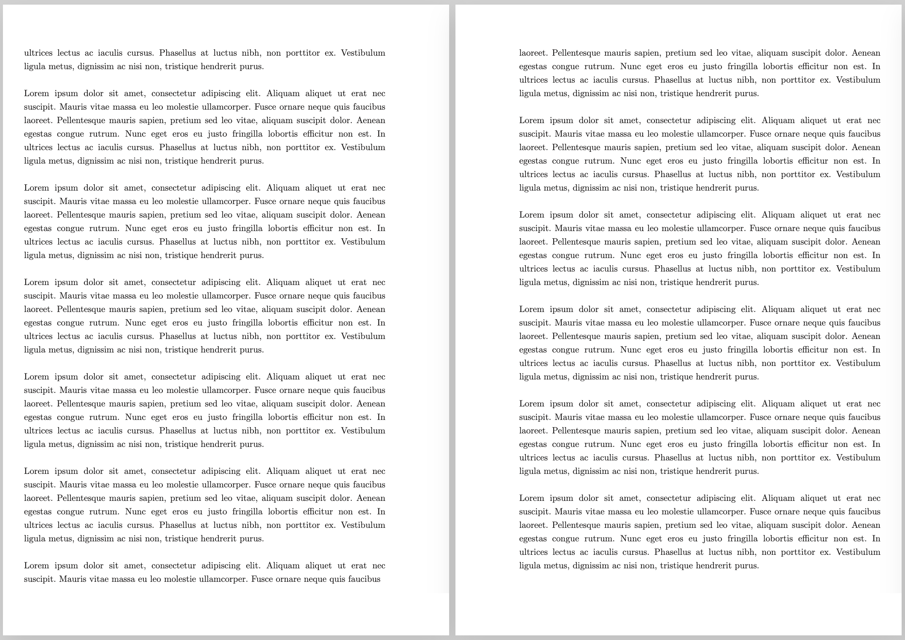

> For the complete documentation index, see [llms.txt](https://quarkdown.com/wiki/llms.txt).

# Page format

The **`.pageformat`**  function configures the page format. All its parameters are **optional**, and if left unset, they delegate their default value to the underlying renderer depending on the document type.

Multiple calls to `.pageformat` are layered on top of each other, with later calls overriding earlier ones.

| Parameter | Description | Accepts | Supported documents |
| --- | --- | --- | --- |
| `side` | Restricts the format to left (verso) or right (recto) pages only. See [Scoped formatting](#scoped-formatting). | `left`, `right` | `paged` |
| `pages` | Restricts the format to specific pages by 1-based inclusive range. See [Scoped formatting](#scoped-formatting). Combinable with `side`. | Range, e.g. `2..5` | `paged` |
| `size` | Name of the paper format. | `A0`..`A10`, `B0`..`B5`, `letter`, `legal`, `ledger` | `paged`, `slides` |
| `width` | Page width. If `size` is set too, this value overrides its width. | [`Size`](sizes.md#size-single-size), e.g. `300px`, `15cm`, `5.8in` | `plain`, `paged`, `slides`, `docs` |
| `height` | Page height. If `size` is set too, this value overrides its height. | [`Size`](sizes.md#size-single-size), e.g. `300px`, `15cm`, `5.8in` | `paged`, `slides` |
| `orientation` | Whether width and height of the paper format (`size`) should be swapped. This defaults to `portrait` for `plain` and `paged` documents and to `landscape` for `slides`. | `portrait`, `landscape` | `paged`, `slides` |
| `margin` | Blank space between page borders and content area. | [`Sizes`](sizes.md#size-group-sizes), e.g. `1cm`, `15mm 30px`, `2in 1in 3in 2in` | `plain`, `paged`, `slides` |
| `bordertop`, `borderright`, `borderbottom`, `borderleft` | Thickness of the border at each side of the content area. | [`Size`](sizes.md) | `plain`, `paged`, `slides` |
| `bordercolor` | Color of the border around the content area. | [`Color`](color.md) | `plain`, `paged`, `slides` |
| `background` | Background color of each page. | [`Color`](color.md) | `plain`, `paged`, `slides`, `docs` |
| `columns` | Number of columns in each page. If set to 2 or higher, the document has a [multi-column layout](multi-column-layout.md). | Positive integer | `plain`, `paged`, `slides` |
| `alignment` | Horizontal content and text alignment. | `start` (default in `slides`), `center`, `end`, `justify` (default in `plain` and `paged`) | `plain`, `paged`, `slides`, `docs` |

## Content area

Each page consists of a *content area* in which the main content is displayed, and a *margin area*, a blank outline that may host [page margin content](page-margin-content.md) such as [page counters](page-counter.md).



### Margins

The `margin` parameter affects the size of the margin area, reducing the surface of the content area.

> **Example 1**
> 
> ```markdown
> .pageformat margin:{4cm}
> ```
> 
> 

### Borders

The `bordertop`, `borderright`, `borderbottom`, `borderleft`, and `bordercolor` parameters allow customization of borders around the content area of each page in `paged` and `slides` documents.

- If you specify at least one side, the border applies to the specified sides. If you do not specify the color, it uses the default foreground text color.
- If you do not specify any side but do specify the color, the border applies to all sides with a default thickness.

> **Example 2**
> 
> ```markdown
> .pageformat bordertop:{1px} borderbottom:{4px}
> ```
> 
> 

## Scoped formatting

In `paged` documents, the `side` and `pages` parameters restrict a format to specific pages.

### Per-side formatting

The `side` parameter restricts a format to left (verso) or right (recto) pages only. This is useful, for example, for mirrored margins in book-style layouts.

> **Example 3**
> 
> ```markdown
> .pageformat size:{A4}
> .pageformat side:{left} margin:{2cm 3cm 2cm 1cm}
> .pageformat side:{right} margin:{2cm 1cm 2cm 3cm}
> ```
> 
> 

### Per-range formatting

The `pages` parameter restricts a format to an inclusive range of page indices, starting from 1. This is useful, for example, for applying distinct styles to the first few pages of a document.

```
.pageformat pages:{2..5} margin:{3cm}
```

`side` and `pages` can also be combined to target specific sides within a range:

```
.pageformat side:{left} pages:{1..3} bordercolor:{green}
```