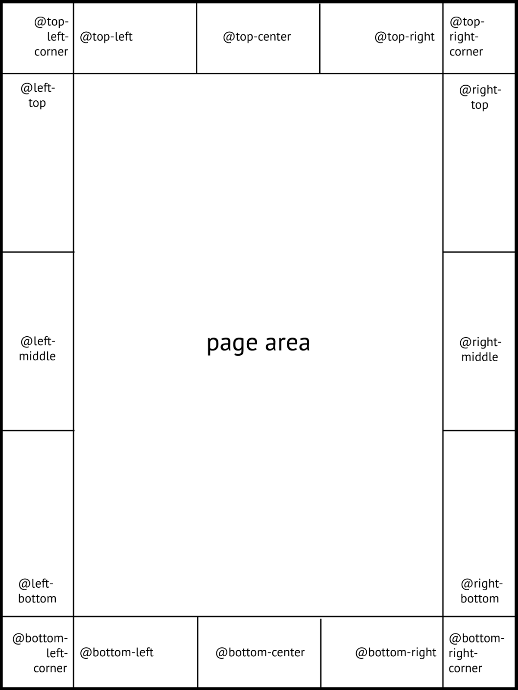
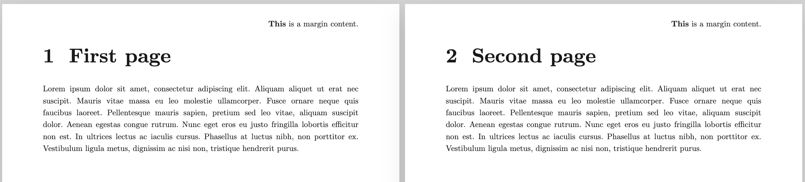
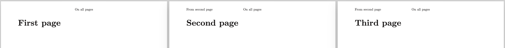
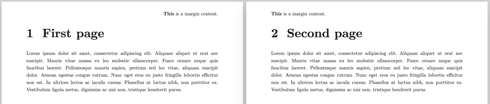
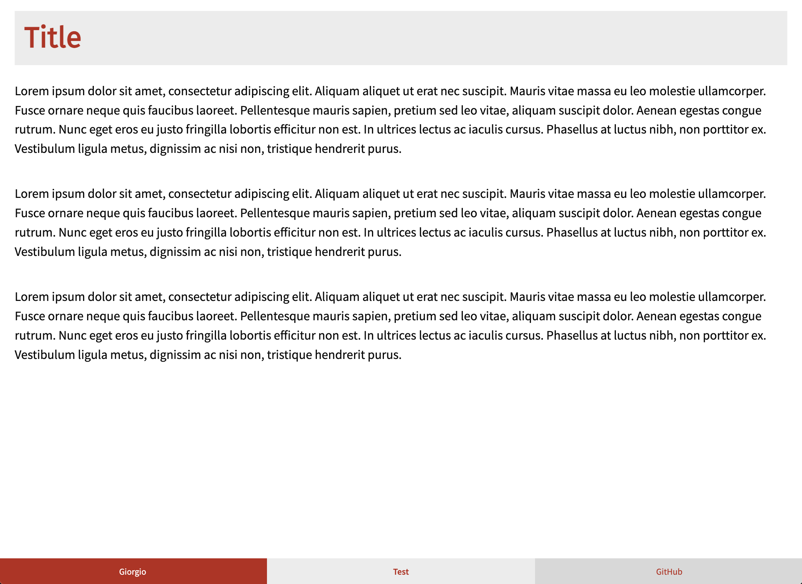

> For the complete documentation index, see [llms.txt](https://quarkdown.com/wiki/llms.txt).

# Page margin content

The **`.pagemargin`** function displays content on each page in a fixed position along its [margins](page-format.md#content-area).

- In `paged` documents, a special area of each page is reserved for margins:

  

  > Credits: [Paged.js](https://pagedjs.org/documentation/7-generated-content-in-margin-boxes/#margin-boxes-of-a-page)

- 

- In `plain` and `slides` documents, content set on margins could potentially overlap page content.

- 

- In `plain` documents, where the concept of *page* does not exist, page margins are displayed once per document.

The function accepts an optional `position` and a body argument `content`:

| Parameter | Description | Accepts |
| --- | --- | --- |
| `position` | Page area to target. | `topleftcorner`, `topleft`, `topcenter`, `topright`, `toprightcorner`, `righttop`, `rightmiddle`, `rightbottom`, `bottomrightcorner`, `bottomright`, `bottomcenter`, `bottomleft`, `bottomleftcorner`, `leftbottom`, `leftmiddle`, `lefttop`, *`topoutsidecorner`, `topoutside`, `topinsidecorner`, `topinside`, `bottomoutsidecorner`, `bottomoutside`, `bottominsidecorner`, `bottominside`* |
| `content` | Element to display. | [Block content](markdown-content.md#block-content) |

> **Example 1**
> 
> ```markdown
> .pagemargin {topright}
>     **This** is a margin content.
> ```
> 
> 

## Scoped margins

When used in `paged` and `slides` documents, page margin content takes effect only from the page where it is declared onward. This allows for different page margin settings in different parts of the document.

> **Example 2**
> 
> ```markdown
> .pagemargin {topcenter}
>     On all pages
> 
> ## First page
> 
> ## Second page
> 
> .pagemargin {topleft}
>     From second page
> 
> ## Third page
> ```
> 
> 

Overwriting the page margin again changes it from that point onward.

> **Example 3**
> 
> ```markdown
> ...
> 
> ## Third page
> 
> .pagemargin {topcenter}
>     From third page
> ```
> 
> 

## Mirror positions

Along with fixed positions such as `topright` or `bottomleft`, Quarkdown also supports *mirror positions*, which adapt based on whether the page is left (even number) or right (odd number).

Mirror positions are marked in italics in the table above and refer to `outside` and `inside` areas:

> **Example 4**
> 
> ```markdown
> .pagemargin {topoutside}
>     **This** is a margin content.
> ```
> 
> 

## Footer

Most layout themes associate the `bottomcenter` margin with the document footer and style it differently. For instance, different blocks may be displayed in a row. Footers are particularly common in `slides` documents.

The **`.footer`** function is a shorthand for `.pagemargin {bottomcenter}`.

> **Example 5**
> 
> ```markdown
> .theme {beaver} layout:{beamer}
> 
> .footer
>     .docauthor
> 
>     **.docname**
> 
>     [GitHub](https://github.com/iamgio/quarkdown)
> ```
> 
> 

## Page counter

A page margin can host a page counter. See [Page counter](page-counter.md) for more information.