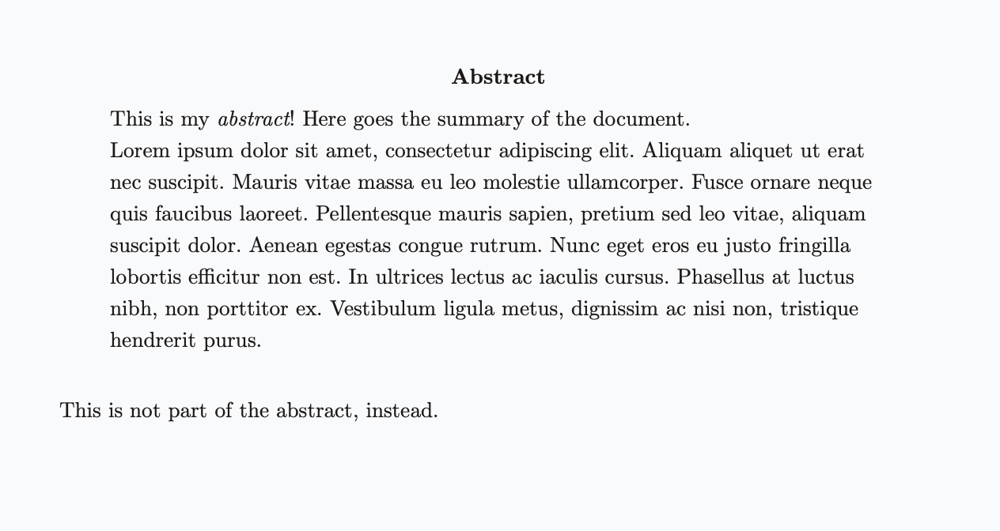
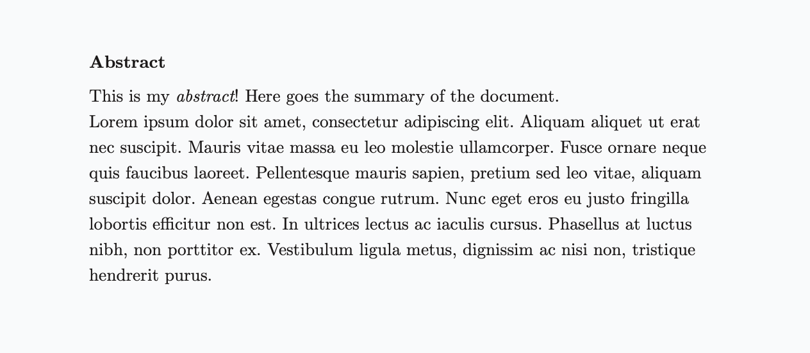
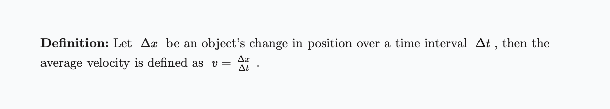
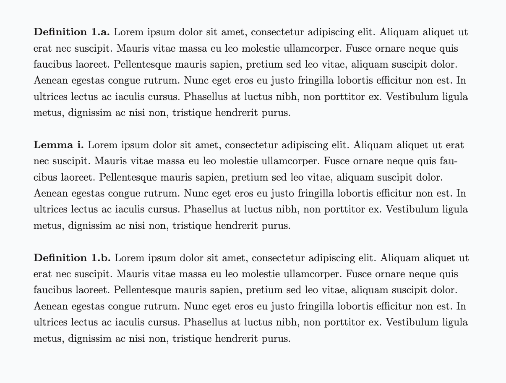
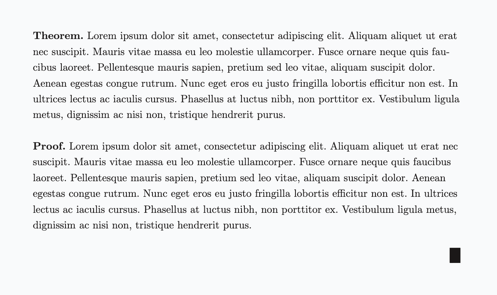
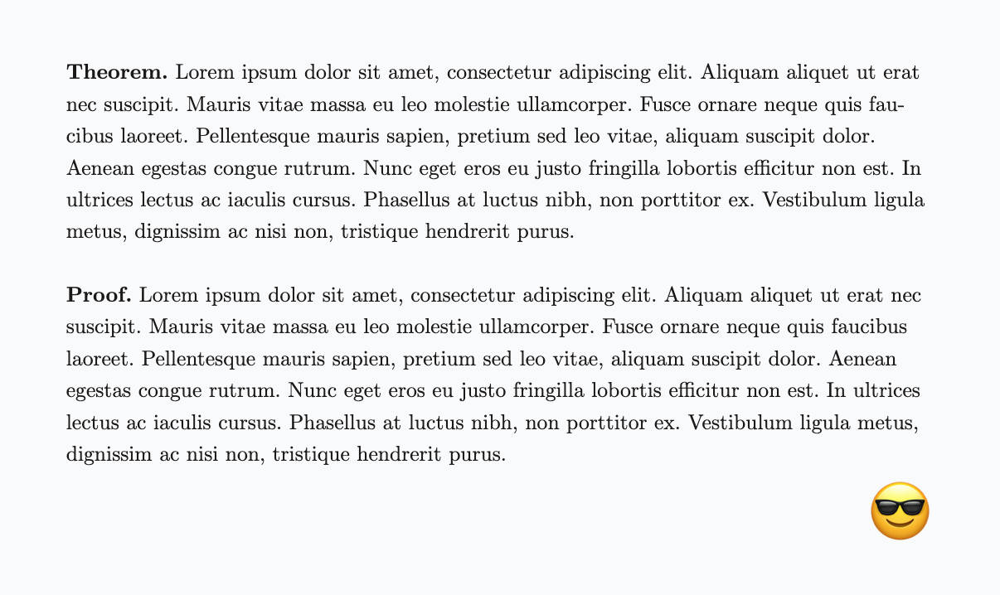

# Paper library

The built-in [`paper`](https://github.com/iamgio/quarkdown/blob/main/quarkdown-libs/src/main/resources/paper) library is written in Quarkdown and adds support for typical elements of scientific papers in a LaTeX fashion.

The library features the following components:

- Abstract
- Titled, numbered blocks:

  - Definitions
  - Lemmas
  - Theorems
  - Proofs

> The supported languages align with those supported by Quarkdown’s core. See [*Built-in localization*](localization.qd) for further information.

The first step is to [import](importing-external-libraries.qd) the library:

```markdown
.include {paper}
```

## Abstract

**`.abstract`** generates the layout for a titled *abstract* block. Its content goes in the block argument.

> **Example 1**
> 
> ```markdown
> .abstract
>     This is my *abstract*! Here goes the summary of the document.  
>     .loremipsum
> 
> This is not part of the abstract, instead.
> ```
> 
> 

The alignment of the title defaults to center and can be changed via `.abstractalignment {start|center|end}`.

> **Example 2**
> 
> ```markdown
> .abstractalignment {start}
> 
> .abstract
>     This is my *abstract*! Here goes the summary of the document.  
>     .loremipsum
> ```
> 
> 

## Titled blocks

You can create any of the following blocks:

- Definition via **`.definition`**
- Lemma via **`.lemma`**
- Theorem via **`.theorem`**
- Proof via **`.proof`**

All the mentioned functions take one block argument that defines the content.

> **Example 3**
> 
> ```markdown
> .definition
>     Let $ \Delta x $ be an object's change in position over a time interval $ \Delta t $,
>     then the average velocity is defined as $ v = \frac {\Delta x} {\Delta t} $.
> ```
> 
> 

### Custom title suffix

The default title suffix is `.` (dot) and can be customized via `.paperblocksuffix {suffix}`:

> **Example 4**
> 
> ```markdown
> .paperblocksuffix {:}
> ```
> 
> 

### Numbering

Defining a [numbering format](numbering.qd) causes the blocks of that type to be numbered. The format names are plural: `definitions`, `lemmas`, `theorems`, `proofs`.

> **Example 5**
> 
> ```markdown
> .numbering
>     - definitions: 1.a
>     - lemmas: i
> 
> ...
> 
> .definition
>     .loremipsum
> 
> .lemma
>     .loremipsum
> 
> .definition
>     .loremipsum
> ```
> 
> 

### End-of-proof

Proofs also feature a special *end-of-proof* character, which defaults to `∎`.

> **Example 6**
> 
> ```markdown
> .theorem
>     .loremipsum
> 
> .proof
>     .loremipsum
> ```
> 
> 

You can customize the end-of-proof character via `.proofend {string}`:

> **Example 7**
> 
> ```markdown
> .proofend {😎}
> ```
> 
> 