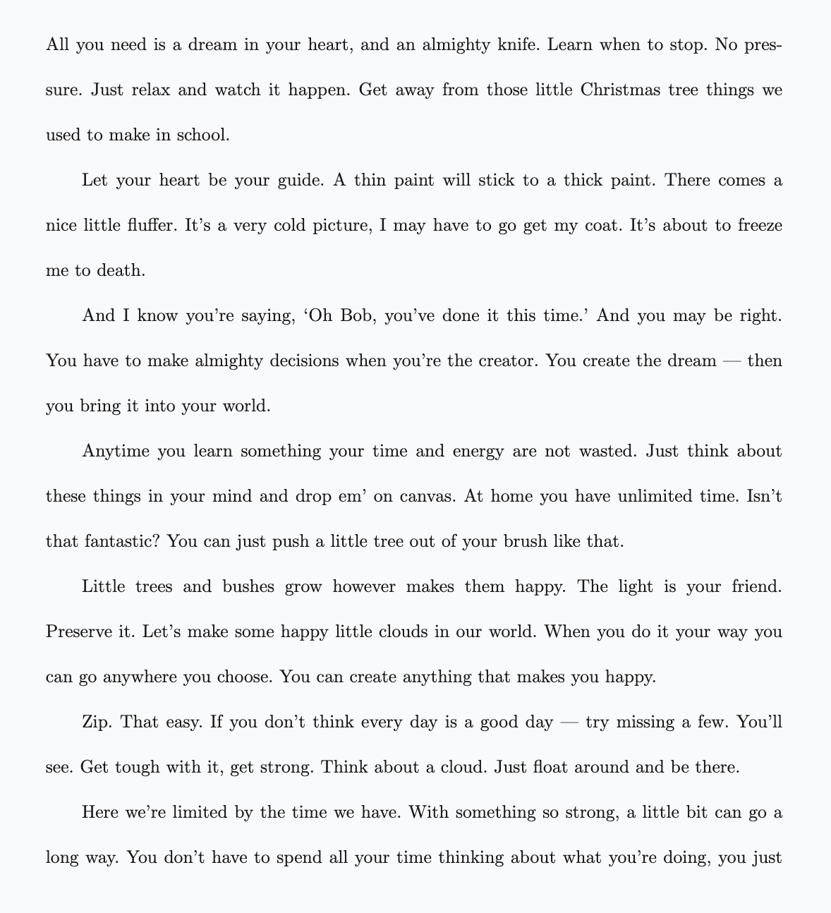

> For the complete documentation index, see [llms.txt](https://quarkdown.com/wiki/llms.txt).

# Paragraph style

The **`.paragraphstyle`**  function allows you to override the global style of paragraphs.

All parameters are optional, and if left unset, they delegate their value to the active theme.

| Parameter | Description | Accepts |
| --- | --- | --- |
| `lineheight` | Whitespace between lines, multiplied by the font size. | Number |
| `letterspacing` | Whitespace between letters, multiplied by the font size. | Number |
| `spacing` | Whitespace between subsequent paragraphs, multiplied by the font size. | Number |
| `indent` | Whitespace at the start of each non-first paragraph, multiplied by the font size. | Number |

Using `spacing:{0} indent:{2}` produces the classic LaTeX look.

> **Example 1**
> 
> ```markdown
> .paragraphstyle lineheight:{2.5} spacing:{0} indent:{2}
> ```
> 
> 