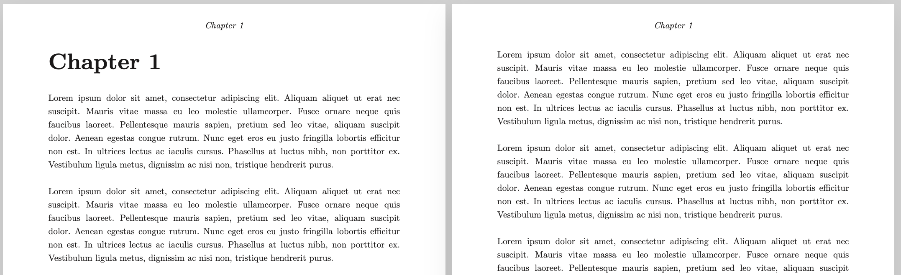
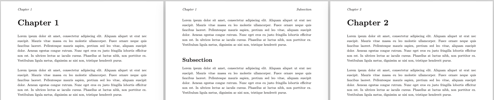

# Persistent headings

The **`.lastheading {depth}`**  function allows you to reference the last heading of a given depth across pages or slides.

When used in combination with [page margin content](page-margin-content.qd), this function enables persistent headings, such as chapter titles or section names, to appear in the page margins.

> `depth` refers to the heading level: `1` for `#`, `2` for `##`, and so on.

> **Example 1**
> 
> ```markdown
> .pagemargin {topcenter}
>     *.lastheading depth:{1}*
> 
> ## Chapter 1
> 
> .repeat {10}
>     .loremipsum
> ```
> 
> 

Note that headings of lesser depth reset the last reference.

> **Example 2**
> 
> In the following example, the depth-2 persistent heading appears when on a depth-2 section (page 2), but resets when entering a depth-1 section (page 3).
> 
> ```markdown
> .pagemargin {topleft}
>     *.lastheading depth:{1}*
> 
> .pagemargin {topright}
>     *.lastheading depth:{2}*
> 
> ## Chapter 1
> 
> .repeat {6}
>     .loremipsum
> 
> ### Subsection
> 
> .loremipsum
> 
> ## Chapter 2
> 
> .repeat {2}
>     .loremipsum
> ```
> 
> 