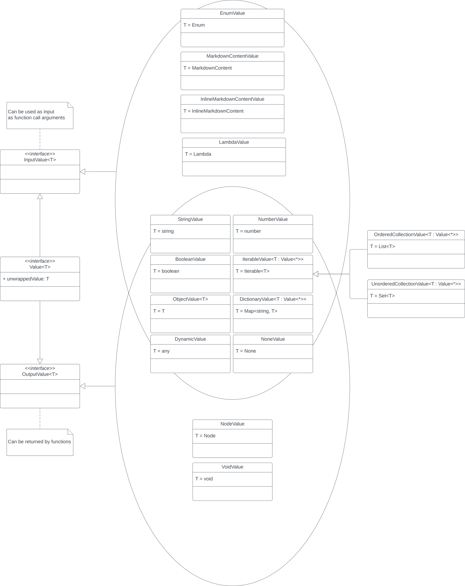

> For the complete documentation index, see [llms.txt](/wiki/llms.txt).

# Pipeline - Function call expansion

> Main packages: [`core.function`](https://github.com/iamgio/quarkdown/tree/main/quarkdown-core/src/main/kotlin/com/quarkdown/core/function)

Among the nodes generated from the [Parsing](pipeline---parsing.md) stage, those of type `FunctionCallNode(context, name, arguments)` represent [function calls](syntax-of-a-function-call.md).

While all other nodes never change after they are created, this is the only kind of *mutable* node, which means its inner data is expected to change after the AST has been fully generated. Its mutation affects its child nodes, which is initially an empty collection that is later populated by a component called *function call expander*.

Before addressing the expansion itself, we should understand how data is exchanged among functions. Quarkdown functions, either explicitly or implicitly, always return a [`Value`](https://github.com/iamgio/quarkdown/tree/main/quarkdown-core/src/main/kotlin/eu/iamgio/quarkdown/function/value), a type-checked object wrapper.

In Quarkdown, not all types can be returned and not all types can be used as arguments. Therefore, functions should feature `InputValue` parameters and return an `OutputValue`. A complete set of value types is visualized in the following Venn-UML diagram:

Whenever a function returns some `OutputValue`, it must be converted to some `Node` that can be rendered on screen. For instance, a `StringValue` becomes text, an `OrderedCollectionValue` becomes an ordered list, a `BooleanValue` becomes a checkbox, a `DictionaryValue` becomes a table, and so on. This operation is handled by a *value-node mapper*.

For each function call node enqueued by the parser, the corresponding function is looked up among loaded libraries[^1], argument-parameter bindings are established[^2], and the function is executed to obtain its output.
After retrieving the output node from the mapper, the expander can push it to the function call’s child nodes, ready for the next stage.

[^1]: User-defined functions are also dynamically stored into a volatile library. Native libraries (e.g. `stdlib`) load their functions via reflection instead.

[^2]: Quarkdown is [dynamically typed](typing.md), while the native libraries are written in a statically typed language (Kotlin). When an argument-parameter binding is created, if the argument’s type is dynamic, a conversion to its parameter’s static type is performed via the `ValueFactory`. If the conversion fails, an error is thrown.