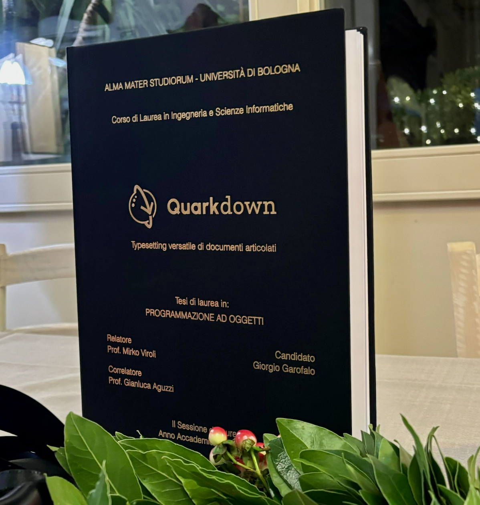

> For the complete documentation index, see [llms.txt](https://quarkdown.com/wiki/llms.txt).

# Pipeline

When you supply an input file to Quarkdown, it undergoes a process of elaboration to be transformed into an output resource, such as an HTML document that the browser can display. Under the hood, this process is represented by a **sequential pipeline**, in which the output of one stage becomes the input of the next one.

1. [**Lexing**](pipeline---lexing.md)
2. [**Parsing**](pipeline---parsing.md)
3. [**Function call expansion**](pipeline---function-call-expansion.md)
4. [**Tree rewrite**](pipeline---tree-rewrite.md)
5. [**Tree traversal**](pipeline---tree-traversal.md)
6. [**Rendering**](pipeline---rendering.md)
7. [**Post-rendering**](pipeline---post-rendering.md)

> *This section aims to be a simplification of what is explained in the author’s Bachelor’s thesis: [Quarkdown – Typesetting versatile di documenti articolati](https://amslaurea.unibo.it/id/eprint/33690/1/garofalo_giorgio_tesi.pdf) (Italian), in which Quarkdown’s architecture is thoroughly explained and documented. The thesis is updated to September 2024, while this section is going to be kept up to date.*
> 
> 