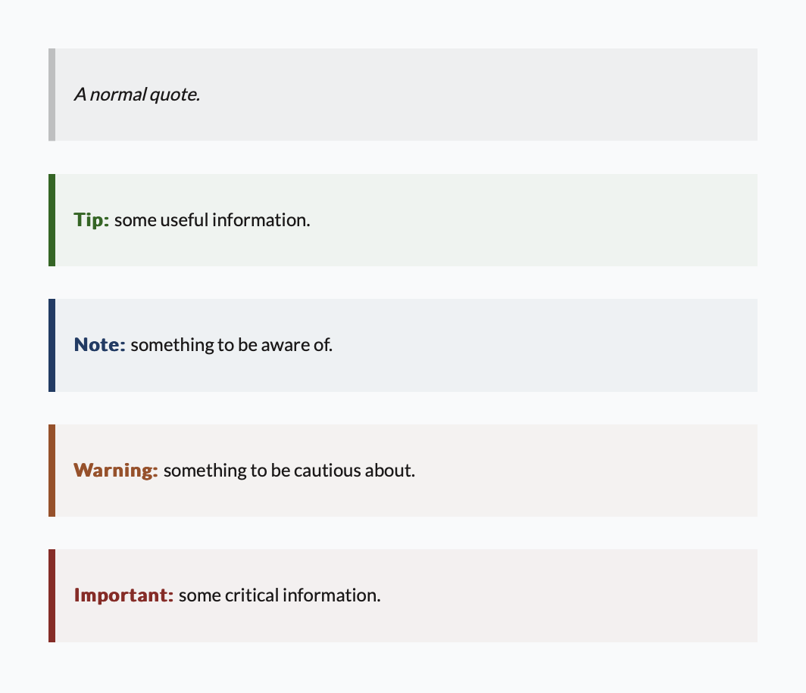
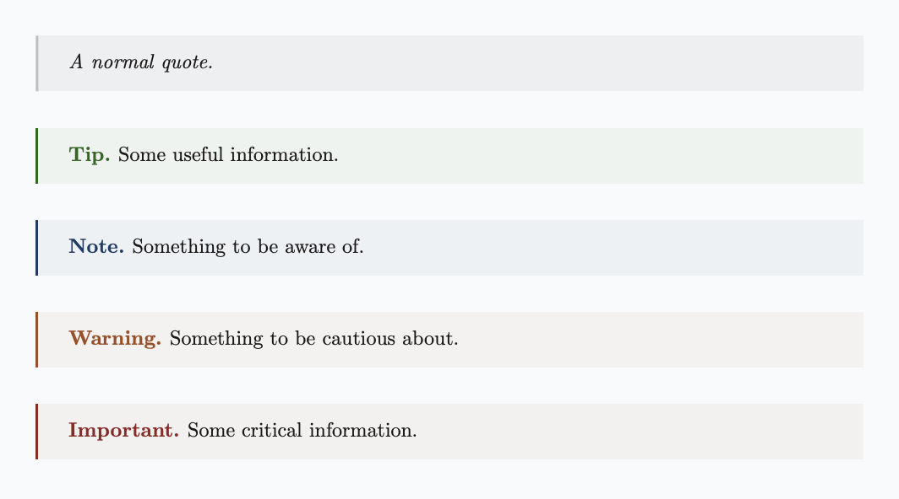

> For the complete documentation index, see [llms.txt](/wiki/llms.txt).

# Quote types

If a blockquote begins with `Tip:`, `Note:`, `Warning:`, or `Important:`, Quarkdown assigns that type to the quote. The prefix is stripped off and the element is styled accordingly.

> **Example 1**
> 
> ```markdown
> > Note: Some useful information to keep in mind.
> ```
> 
> > Some useful information to keep in mind.

For compatibility purposes, the GitHub-style syntax `[!NOTE]`, `[!TIP]`, `[!WARNING]`, and `[!IMPORTANT]` is also supported.

> **Example 2**
> 
> ```markdown
> > [!NOTE]
> > Some useful information to keep in mind.
> ```
> 
> > Some useful information to keep in mind.

If the document’s locale is set via [`.doclang`](document-metadata.qd) and the locale is supported, a localized prefix is displayed and styled according to the current layout theme.


Localized prefix in the ‘minimal’ layout theme


Localized prefix in the ‘latex’ layout theme

> Quotes and [boxes](box.qd) are different ways to achieve typed alerts.