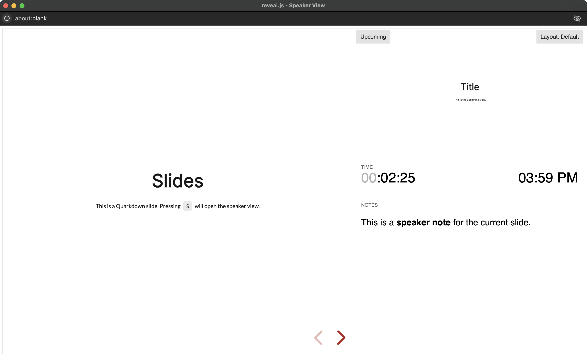
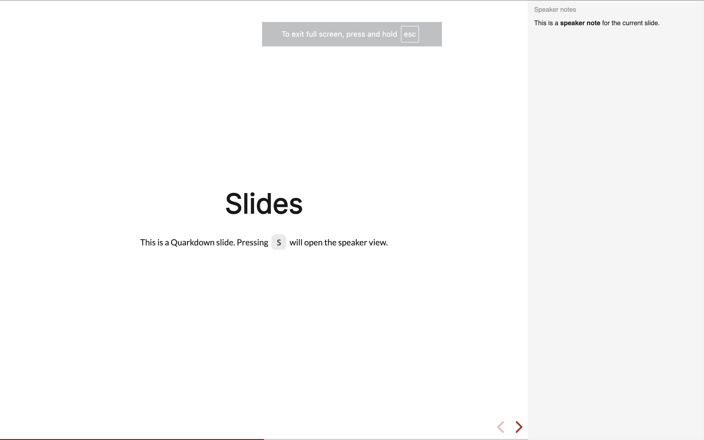
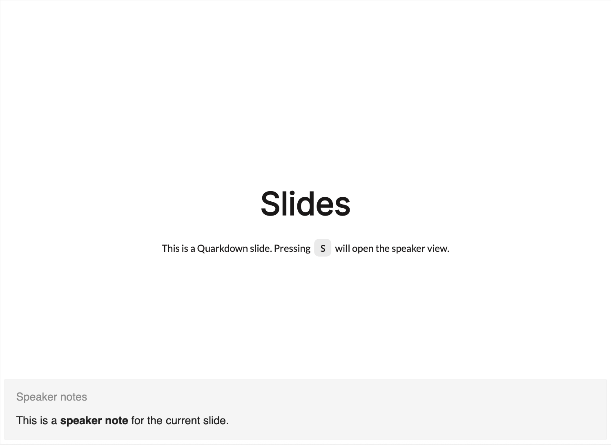

> For the complete documentation index, see [llms.txt](https://quarkdown.com/wiki/llms.txt).

# Slides speaker notes

Speaker notes are helpful tools for remembering talking points, reminders, or extra details while presenting.

Calling the **`.speakernote`** function adds a speaker note to the current slide. The function accepts a block of any kind of content, and you can add multiple speaker notes to the same slide.

```markdown
.speakernote
  This is a **speaker note** for the current slide.
```



By default, speaker notes are displayed only when the document is viewed in the **speaker view**, which you can enable by pressing the **`S`** key while viewing the HTML presentation.

> Reveal.js’ speaker view requires an active [web server](cli-webserver.md).

### Outside speaker view

Additionally, notes may be displayed outside the speaker view, and also in exported PDF, by enabling `.slides speakernotes:{yes}` (see [Slides configuration](slides-configuration.qd)).

- HTML:

  

- 

- PDF:

  