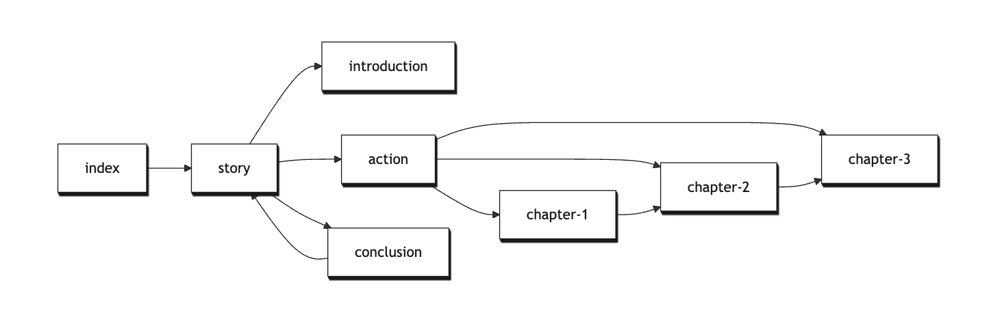

> For the complete documentation index, see [llms.txt](https://quarkdown.com/wiki/llms.txt).

# Subdocuments

When referring to a Quarkdown *document*, we are talking broadly about the group of resources that make up a Quarkdown project.

Commonly, especially in the case of knowledge management and wikis like this one, pages can have links that point to other pages, building a network of interconnected ***subdocuments***.

In Quarkdown, a subdocument’s entry point is a source file that is referenced by another subdocument. In practice, when I do [this](quickstart.md), I am referring to a subdocument.

Every project consists of at least one subdocument: the main one, called *root*.

> Do not confuse subdocuments with [inclusion](including-other-quarkdown-files.md). See [*Inclusion vs. subdocuments*](inclusion-vs-subdocuments.md) for a comparison.

## Referencing subdocuments

Whenever a Markdown link points to a local `.qd` or `.md` file, it is considered a reference to a subdocument.

```markdown
[My subdocument](file.qd)
```

You can also link to a specific section within a subdocument by appending an anchor:

```markdown
[Section A of my subdocument](file.qd#section-a)
```

Equivalently, you can use the **`.subdocument {path} {label?}`**  function:

```markdown
.subdocument {file.qd} label:{My subdocument}
```

Unlike the link syntax, the function accepts dynamic paths, making it suitable for more complex use cases. For instance, you can use it in combination with [`.listfiles`](listing-files.md) to automatically link all documents in a directory through a [for-each loop](loops.md):

```markdown
.foreach {.listfiles {pages} sortby:{date} order:{descending}}
    path:
    .subdocument {.path} label:{.path::filename}
```


Quarkdown makes sure a file is evaluated only once, so circular and recursive references are handled gracefully.

## Context inheritance

When referencing a subdocument, its content is evaluated like an independent Quarkdown document.

A relevant difference is that **subdocuments inherit the referrer’s context**: document metadata, customizations, functions, variables, and more.

> **Example 1**
> 
> > `main.qd`:
> > 
> > ```markdown
> > .doctype {paged}
> > .theme {darko}
> > .pageformat margin:{1cm}
> > 
> > .function {greet}
> >     Hello!
> > 
> > [Introduction](introduction.qd)
> > ```
> 
> > `introduction.qd`:
> > 
> > ```markdown
> > No need to set the document up again, it's already inherited!
> > 
> > .greet
> > ```

Unlike [`.include`](including-other-quarkdown-files.md), the context is *inherited*, not *shared*: changes made in the subdocument do not affect the referrer.

> **Example 2**
> 
> The following example produces an error because `greet` is not defined in the referrer context:
> 
> > `main.qd`:
> > 
> > ```markdown
> > [Introduction](introduction.qd)
> > 
> > .greet <!-- Error: unresolved -->
> > ```
> 
> > `introduction.qd`:
> > 
> > ```markdown
> > .function {greet}
> >     Hello!
> > ```

## Working directory

The working directory of a subdocument is relative to the subdocument’s entry point, not the referrer:

- main.qd
- pages/

  - introduction.qd
- images/

  - image.png

Whereas `main.qd` can reference `images/image.png`, `introduction.qd` should reference it as `../images/image.png`.

> The [media storage system](media-storage.md) can still store media files across subdocuments.

## Subdocument graph

Subdocuments are structured in a directed graph, where the edges are the links between them.

You can visualize the graph via the **`.subdocumentgraph`** function:



## Output

Subdocuments are exported differently depending on the output target.

### HTML

Each subdocument is exported as a separate subdirectory in the same directory as `index.html`.

Configuration resources, such as themes and runtime scripts, are generated only once. [Media](media-storage.md) is stored per subdocument instead.

- MyDocument/

  - media
  - theme
  - script
  - introduction/

    - media
    - index.html
  - conclusion/

    - media
    - index.html
  - index.html

### PDF

Each subdocument is exported as a separate PDF file.

- MyDocument/

  - index.pdf
  - introduction.pdf
  - conclusion.pdf

> Subdocument links in PDF output are not navigable yet.

If only the root subdocument is present, then only `MyDocument.pdf` is generated without the need for a directory.

### Output naming

By default, subdocument output files are named after their source file name. This behavior can be customized via the `--subdoc-naming <strategy>` compiler option. This applies to all output targets, such as HTML and PDF.

> **Example 3**
> 
> `getting-started.qd` → `getting-started.pdf`

#### Document name

Launching the compiler with `--subdoc-naming document-name` names each subdocument output after their own [`.docname`](document-metadata.md), rather than the source file name. If a subdocument does not set `.docname`, the source file name is used as a fallback. Note that duplicate document names are not handled, and may lead to name collisions and overwritten files.

> **Example 4**
> 
> `getting-started.qd` with `.docname {Getting Started}` → `Getting-Started.pdf`

#### Minimizing name collisions

Since the subdocument output files lie flatly in the same directory, it is possible that two subdocuments with the same name but from different directories end up colliding.

By default, Quarkdown accepts this collision-prone behavior in order to generate human-readable URLs.

If collisions cannot be avoided, launching the compiler with `--subdoc-naming collision-proof` will append a hash to the output file names.

> **Example 5**
> 
> `getting-started.qd` → `getting-started@12345678.pdf`